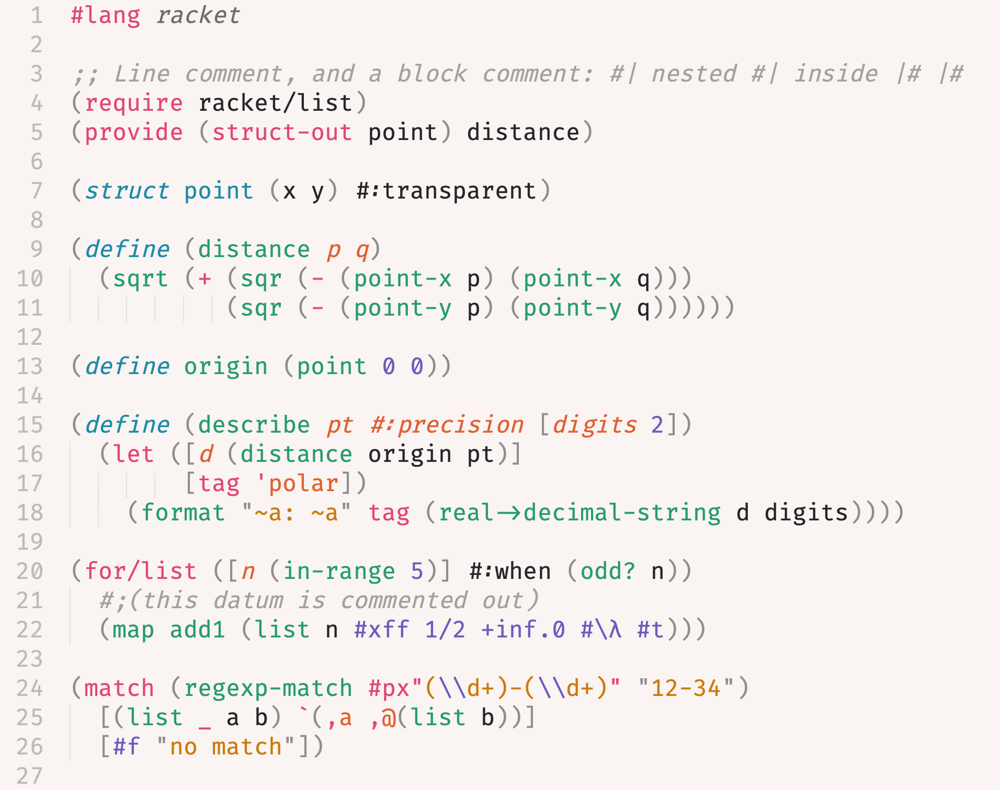

# Racket

A Sublime Text 4 plugin for the [Racket](https://racket-lang.org) programming language.

Current features include:

- syntax definition and highlighting: every Racket form and literal is scoped
- build system: run, test, compile and format from command palette
- symbol indexing: `Goto Symbol` lists defined functions and structs
- comment settings: `Toggle Comment` uses `;` and `#| |#`
- bracket handling: auto-indent after an open bracket, outdent on close
- REPL: open a Racket REPL in Terminus and send a file, selection, definition
  or s-expression to it from command palette



## Installation

Via Package Control: `Package Control: Install Package`, then choose
**Racket**.

### Recommended setup

- [Terminus](https://packagecontrol.io/packages/Terminus): required by the
  REPL commands
- [LSP](https://packagecontrol.io/packages/LSP) with
  [racket-langserver](https://github.com/jeapostrophe/racket-langserver):
  completion, diagnostics, go to definition and hover docs.

Install the server with `raco pkg install racket-langserver`, then register it in `Preferences > Package Settings > LSP > Settings`:

  ```json
  {
    "clients": {
      "racket-langserver": {
        "enabled": true,
        "command": ["racket", "--lib", "racket-langserver"],
        "selector": "source.racket"
      }
    }
  }
  ```

  `racket` must be on the `PATH` Sublime sees.

## Features

Detailed information about supported features is in
[docs/features.md](./docs/features.md).
